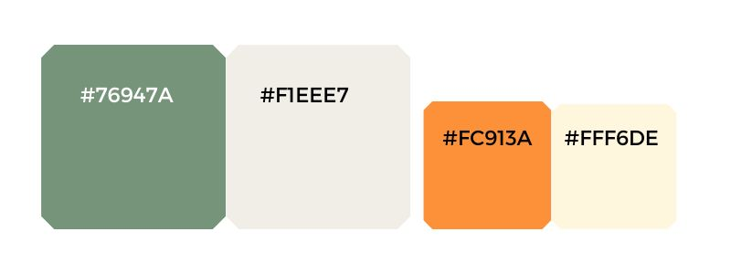
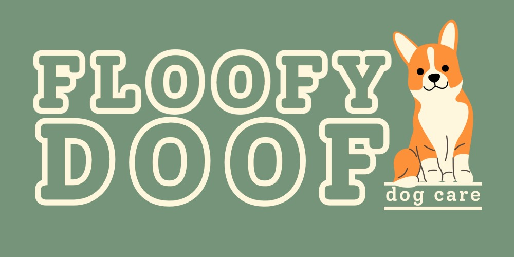

# FloofyDoof Dog Care Website
## Milestone Project 1 - Static Front-End Website

* This website's intended audience are prospective clients of 'FloofyDoof Dog Care' - a pet-sitting service company operating in the North Devon coastal area. The purpose of the website is to 'sell' the company's services to the prospective clients by using responsive appealing aesthetics and clear, effective user-functionality.

## Live Project 

[View the live project here.]

## Repository 

[Find the project repository here]

# Table of Contents 

## Contents
- [User experience](#user-experience)
  * [User Stories](#user-stories)
  + [Prospective clients](#prospective-clients)
  + [Business Owners](#business-owners)

- [Design](#design)
  + [Colour Palette](#colour-palette)
  + [Typography](#typography)

- [Structure](#structure)
  + [Information Architecture](#information-architecture)
  + [Navigation Bar](#navigation-bar)
  + [Back To Top Button](#back-to-top-button)
  + [Buttons](#buttons)
  + [Footer](#footer)

- [Wireframes](#wireframes)

- [Features](#features)
  + [Current Features](#current-features)
  + [Future Features](#future-features)

- [Technologies used](#technologies-used)
  + [Languages Used](#languages-used)
  + [Frameworks Libraries and Programs](#frameworks-libraries-and-programs)

- [Testing](#testing)

[Deployment](#deployment)
  + [GitHub Pages](#github-pages)

- [Credits](#credits)
  + [Code](#code)
  + [Media](#media)
  + [Content](#content)
  + [Acknowledgements](#acknowledgements)

# User Experience

## User stories

### Prospective Customers
*Prospective clients using this website will be dog-owners in need of dog-sitting services in the Devon/Somerset area.* 

* As a prospective customer I need to know the if the services offered by FloofyDoof Dog Care suit my requirements. 
* As a prospective customer I need to know if my location is covered by the company for collection/drop-off walking services; and/or the proximity of their day-care & boarding centre to my location.
* As a prospective customer I would like to know the level of the company's experience and their 'philosophy' on dog-care.
* As a prospective customer I need to know how to find out more details and/or availability. 
* As a prospective customer I would like the website to have predictable navigation and clear information.

### Company-Owner

* As the company-owner I want my website to have excellent functionality and aesthetic appeal on any device.
* As the company-owner I want my website to strongly and positively communicate my 'brand'.
* As the company-owner I want my website to strongly feature calls-to-action to encourage social-media exploration and direct contact from prospective customers.

## Design

### Color Palette

<h2></h2>

### Logo

<h2></h2>

### Typography

<h2></h2>

### Imagery

### Icons

## Structure

### Information Architecture

### Navigation Bar

### Buttons

### Back To Top Button

### Footer

## Wireframes
- [View my wireframes in PDF form here.]

# Features

## Current Features

## Buildable Features / Future Features

# Technologies Used

## Languages Used

- [HTML5](https://en.wikipedia.org/wiki/HTML5)

- [CSS3](https://en.wikipedia.org/wiki/CSS)

## Frameworks Libraries and Programs

- [Bootstrap 5](https://getbootstrap.com/) 

- [Google Fonts](https://fonts.google.com/)

- [Font awesome](https://fontawesome.com/)

- [Git](https://git-scm.com/)
  - Git was used as a version control in the terminal.

- [Github](https://github.com/)
  - Github was used to create and store the project repository.

- [Gitpod](https://gitpod.io/)
  - Gitpod was used

   [Balsamiq](https://balsamiq.com/)
  - Balsamiq was used to create Wireframe

  - [Adobe Express](https://www.adobe.com/ie/products/express.html)

  # Testing
- Please see [here](TESTING.md)

# Deployment

## GitHub Pages

# Credits

## Content

## Media 

## Acknowledgements

FloofyDoof Dog Care is fictitious and not for public consumption.

Lois Stenner, 2022.

